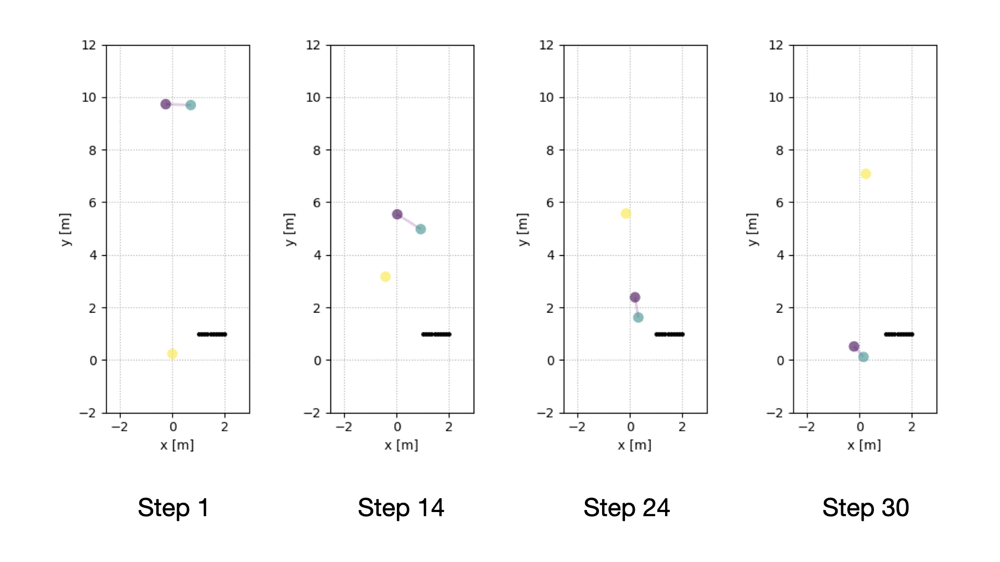
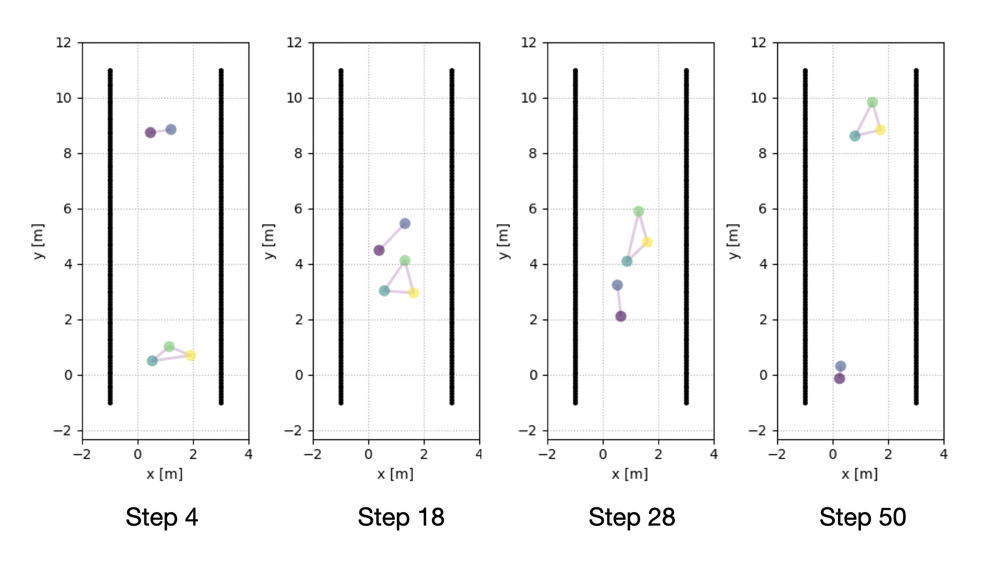

# Summary

Socially-acceptable navigation in a crowded environment remains a largely unsolved topic in mobile robots. To understand crowd motion, robots must understand the social interaction between the pedestrians, and dataset containing this kind of information is crucial for training and validating social navigation algorithms. However, manually collecting and annotating pedestrian interaction data can be costly and subjective. Therefore, modelling of pedestrians with social constraints and group information could be greatly helpful for researchers to understand social norms and how robots should act around humans. The social force model proposed by @Helbing:1995 suggested that pedestrian behaviors can be modelled as if they were subject to "social forces". @Moussaid:2010 extended this model by incorporating forces for social groups as the social groups play a predominant role in crowd dynamics.

`PySocialForce` is a pure Python package for simulating crowd dynamics using extended social force model. It is designed to be used by social navigation researchers to generate crowd interaction data and to validate their models, and Python enables it to be easily extensible to add new custom "social forces" and to be used in reinforcement learning environments. We have used it with [OpenAI Gym](https://gym.openai.com/) in our own unpublished project to generate exmaples for a reinforcement learning algorithm for social navigation.

# The `PySocialForce` Package
`PySocialForce` implements the social force model described in [@Moussaid:2009], and its extension with social groups described in [@Moussaid:2010]. The package started as a fork of [@socialforce], which implements the original social force model proposed in [@Helbing:1995]. We ended up completely rewrote the package to use the newer version of the social force model in [@Moussaid:2009; @Moussaid:2010] with its core functions accelerated with just-in-time compilation using [Numba](https://numba.pydata.org/). It also drew inspirations from the [@pedsimros] package. [@pedsimros] is a [ROS](https://www.ros.org/) package that implements the extended social force model. However, it is a GUI application and has dependency on both ROS and [QT](https://www.qt.io/). We have found it difficult to run [@pedsimros] on servers without an X Window System.

In `PySocialForce`  we calculate six default forces. Three of them [@Moussaid:2009] are for individuals including the repulsive forces between pedestrians, the attractive forces betweeen each pedestrian and their goals, and the repulsive force from the obstacles. Another three of the forces [@Moussaid:2010] are for groups, including the coherence force that holds the group members together, the repulsove force that keep members from getting too close, and a force calculated from the gaze directions to keep the formations of the groups. Users can easily build their own forces by inheirting from the `Force` metaclass.

To use `PySOcialForce`, the user passes in the initial states, including position, velocity and goal of the pedestrians as its input, and optionally, the social groups information and obstacles. The custom parameter configurations can be passed in as a `toml` file. As shown in the example below:

```Python
import numpy as np
import pysocialforce as psf
# initial states, each entry is the position, velocity and goal of a pedestrian in the form of (px, py, vx, vy, gx, gy)
initial_state = np.array(
    [
        [0.0, 10, -0.5, -0.5, 0.0, 0.0],
        [0.5, 10, -0.5, -0.5, 0.5, 0.0],
        [0.0, 0.0, 0.0, 0.5, 1.0, 10.0],
    ]
)
# social groups informoation is represented as lists of indices of the state array
groups = [[0, 1], [2]]
# list of linear obstacles given in the form of (x_min, x_max, y_min, y_max)
obstacles = [[1, 2, 1, 1]]
# initiate the simulator and pass in the states
simulator = psf.Simulator(initial_state, groups=groups, obstacles=obstacles, config_file="my_config.toml")
# run simulator for 50 steps
simulator.step(50)
```

After the simulation finishes, one can easily generate an animation of the simulation with the provided `ScenVisualizer` context:

```Python
with psf.plot.SceneVisualizer(simulator, "output_image") as sv:
    sv.animate()
```

The end result of this example is as shown in \autoref{fig:example} as captures of different steps of the simulation. In this example, a group of two people enconter one pedestrian comming from another direction and steer clear of an obstacle in their path. Group memebers are interconnected with a purple line. \autoref{fig:corridor} shows another eample with a different setup. In this example, two groups passed each other in a narrow corridor.





# Acknowledgments
This project is a fork of [@socialforce]. We acknoeledge the support from the Johns Hopkins Institute for Assured Autonomy.

# References
